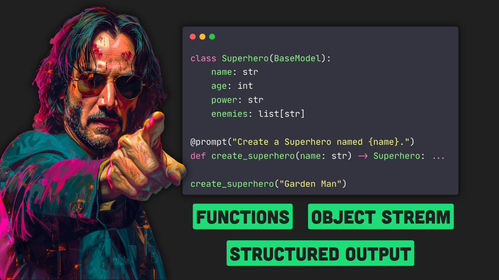

# Magentic + LiteLLM Tutorial

This tutorial is available on myt Youtube channel:
[](https://www.youtube.com/watch?v=VSfehUJUWQY)
[YouTube Video](https://www.youtube.com/watch?v=VSfehUJUWQY).

## Overview

This repository hosts a tutorial to help Python developers understand and leverage the Magentic API along with LiteLLM for integrating state-of-the-art language models into their projects. The tutorial is designed to be user-friendly and comprehensive, guiding users through the essentials of setting up, choosing backends, creating prompts, and streamlining interactions with large language models (LLMs).

## Features

- **Simplified Integration**: Learn how to seamlessly add Magentic and LiteLLM capabilities to Python applications.
- **Backend Selection**: Tutorials on choosing and switching between various LLM backends.
- **Advanced Prompt Handling**: Including structured prompts, chat prompts, and the use of decorators for clean and maintainable code.
- **Function Invocation**: Empower your LLM to perform function calls for extended functionality.
- **Asynchronous Operations**: Discover how to utilize async support for better performance and responsiveness.
- **Progressive Results**: Implement streaming and object streaming to manage large outputs and provide real-time feedback.

## Getting Started

To start using the tutorial, clone this repository and install the required dependencies using poetry:

```
git clone repo
cd repo
poetry install
```

## Prerequisites

Ensure you have the following installed on your system:

- Python 3.12 or later
- Poetry for dependency management

## Tutorial Structure

The tutorial is divided into executable Jupyter notebooks, each focusing on different aspects of using Magentic with LiteLLM:

1. **1_prompt_demo.ipynb**: Demonstrates the basic prompts functionality.
2. **2_backend_choice.ipynb**: Guides on how to select and work with different LLM backends.
3. **3_chat_prompting.ipynb**: Focuses on chat prompting for dialog-based applications.
4. **4_structured_output.ipynb**: Introduces structured outputs using Pydantic for more precise data handling.
5. **5_function_calling.ipynb**: Shows how to make LLMs call external functions for extended use cases.
6. **6_async_support.ipynb**: Provides examples of how to use asynchronous programming to improve efficiency.
7. **7_streaming_and_object_streaming.ipynb**: Details on managing streaming responses for better user experiences.
   Navigate through each notebook in order to gain a comprehensive understanding of the material covered.

## Support and Contribution

For questions, support, or to contribute to this tutorial, please open an issue or pull request on the GitHub repository. We welcome contributions that help enhance and clarify the content.
